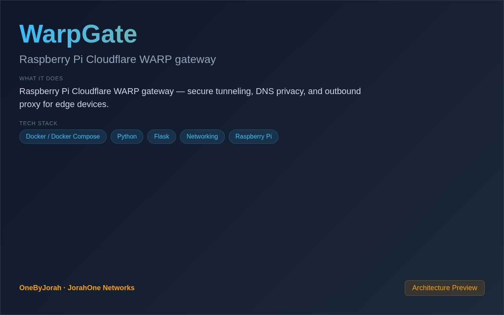

<div align="center">


# WarpGate

Raspberry Pi Cloudflare WARP gateway


</div>

---

<p align="center">
  
</p>

<br>

---

## Features

- **Secure Tunneling** — Route all traffic through Cloudflare WARP.
- **DNS Privacy** — Encrypted DNS resolution via Cloudflare.
- **Outbound Proxy** — Transparent proxy for all network devices.
- **Raspberry Pi** — Optimized for Pi 4/5.
- **Zero Config** — Automatic WARP registration.
- **Kill Switch** — Block traffic if WARP disconnects.
- **Split Tunnel** — Choose which traffic goes through WARP.

## Quick Start

### Raspberry Pi

```bash
git clone https://github.com/OneByJorah/WarpGate.git
cd WarpGate

sudo bash setup.sh
sudo systemctl enable warpgate
sudo systemctl start warpgate
```

### Check Status

```bash
warp-cli status
```

## Configuration

| Variable | Default | Description |
|----------|---------|-------------|
| `WARP_MODE` | `warp` | WARP mode (warp/warp+doh) |
| `LISTEN_PORT` | `5000` | Dashboard port |
| `SPLIT_TUNNEL` | `false` | Enable split tunneling |
| `KILL_SWITCH` | `true` | Block traffic on disconnect |

## Architecture

```
Devices ──Gateway──▶ WarpGate ──WARP──▶ Cloudflare ──▶ Internet
                        │
                        ├──▶ DNS Privacy
                        ├──▶ Traffic Encryption
                        └──▶ Dashboard
```

## Project Structure

```
WarpGate/
├── setup.sh               # Pi setup script
├── warpgate/
│   ├── config.py          # Configuration
│   ├── monitor.py         # WARP status monitor
│   └── dashboard.py       # Web dashboard
├── templates/             # HTML templates
├── warpgate.service       # systemd service
└── README.md
```

## Contributing

Contributions are welcome. Please see [CONTRIBUTING.md](CONTRIBUTING.md) for guidelines and [CODE_OF_CONDUCT.md](CODE_OF_CONDUCT.md) for community standards.

## Security

For security concerns, see [SECURITY.md](SECURITY.md). Please report vulnerabilities to **info@jorahone.com** — do not use public issues.

## License

MIT © Jhonattan L. Jimenez

---

## 🤝 Contributing

See [CONTRIBUTING.md](CONTRIBUTING.md). All contributions follow the [Code of Conduct](CODE_OF_CONDUCT.md).

## 🔒 Security

Found a vulnerability? Please follow our [Security Policy](SECURITY.md) and report privately to `security@jorahone.com`.

## 📄 License

[MIT License](LICENSE) © Jhonattan L. Jimenez (OneByJorah)

---

<p align="center">Built with 🌴 by <a href="https://github.com/OneByJorah">OneByJorah</a> · <a href="https://jorahone.com">jorahone.com</a></p>
